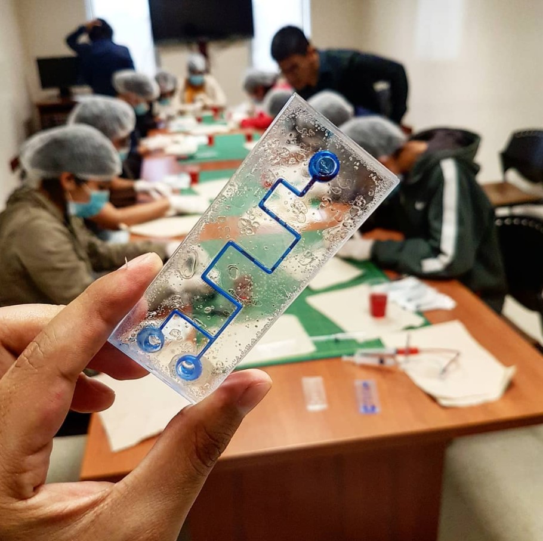

# Welcome to Microfluidics 101!

Welcome to the documentation for the Microfluidics 101 project! A repository for concepts, applications, and resources about Microfluidics in Life Science.

Here are some quick links to help you navigate the documentation depending on what you what you want to do:

## What is Microfluidics 101?

## Why Microfluidics 101?

{ width="300" }

## Who are Microfluidics 101 for?

